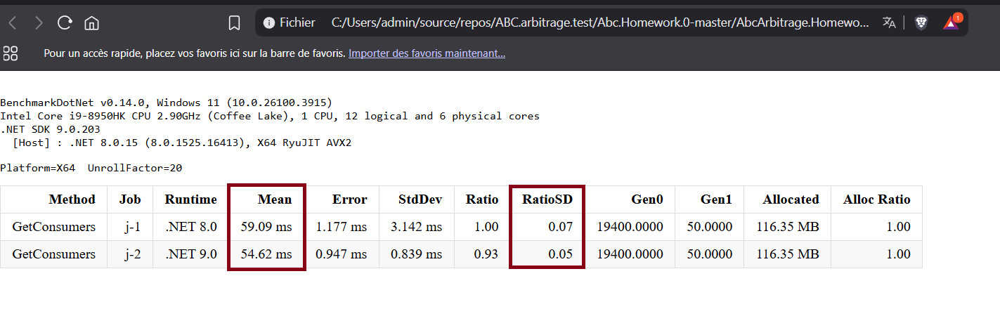
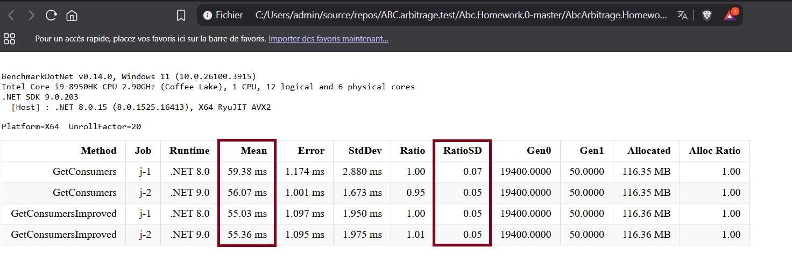
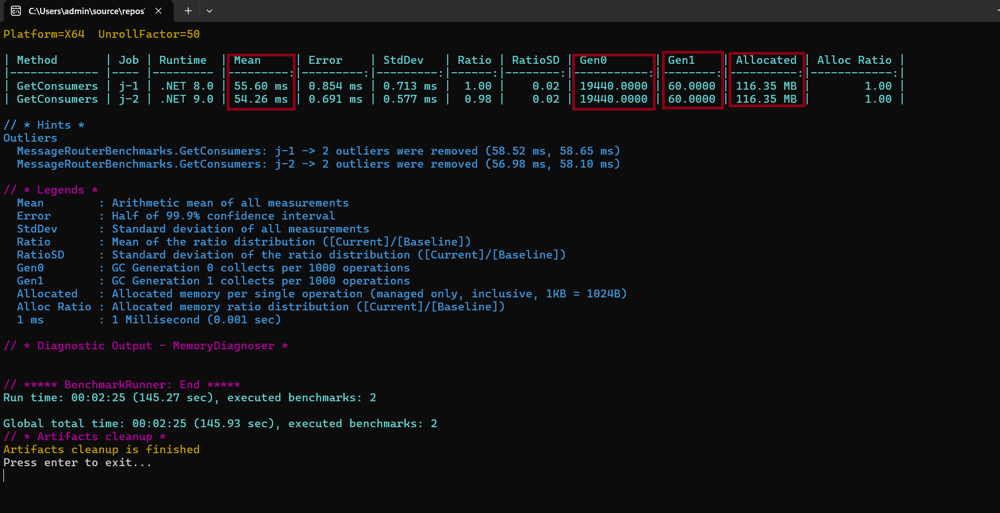
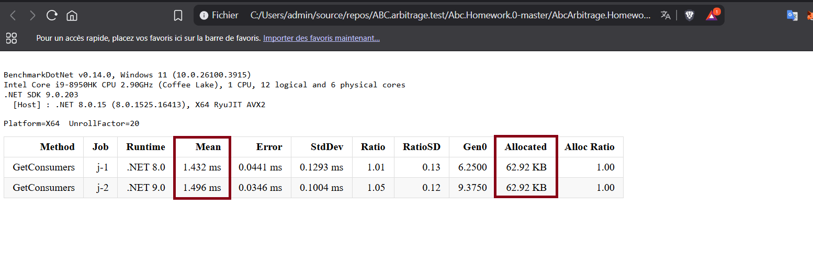
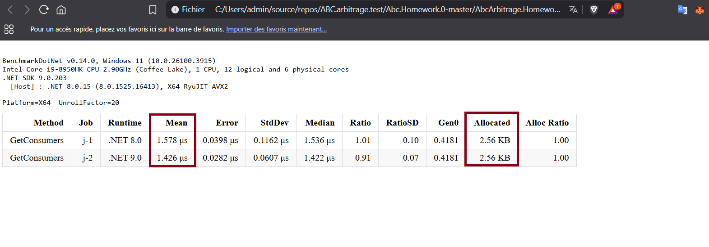
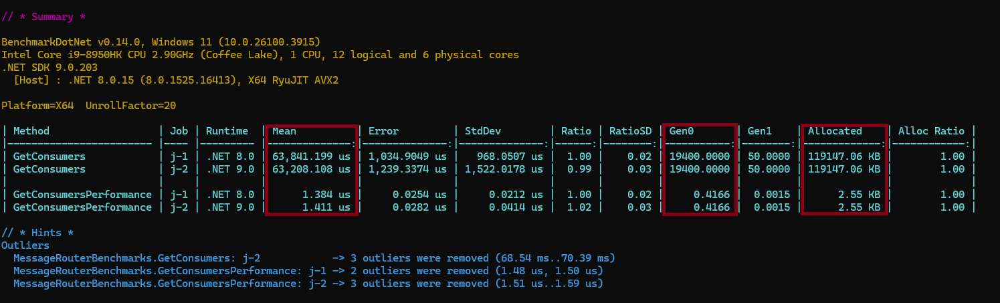
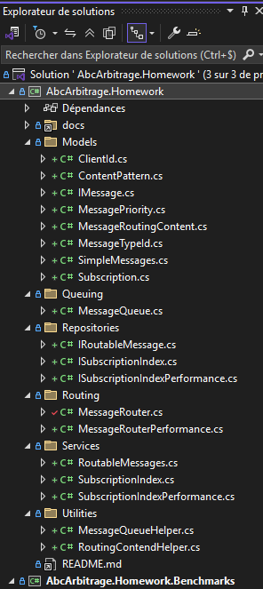

# Routing exercise Answers


Complete this document with your answers.


----

### Candidate Name: Ousmane MBALLO

### Date: 04/24/2025

-----


## A. Implement SubscriptionIndex

- A2.  Write the names of the tests you added here:
  - `ShouldExcludeSubscriptionWithContentPatern(string contentPattern)`
  - `ShouldIncludeSubscriptionWithContentPatern(string contentPattern)`
  - `ShouldRemoveListOfSubscriptions()`
  - `ShouldRemoveSubscriptionByConsumer()`

- A3.  Briefly document your approach here (max: 500 words)
  
  To improve `MessageRouter.GetConsumers` performance, I have try to analyse the method structur at first, to see if we can improve his implementation and there others methods wich it depend (`_subscriptionIndex.FindSubscriptions`). I also needed a tool to mesure the performance of `GetConsumers` method before and after improvment.
    1. I have used the **BenchmarkDotNet** library wich was already referenced in the `AbcArbitrageHomeworkBenchmarks` project. I have setuped a Benchmark config to be able to benchmark the `GetConsumers` method on different dotnet platform (`net8.0 and net9.0`) to get a mesurable values of performance.
    2. I have launch the `AbcArbitrageHomeworkBenchmarks` to bench the `GetConsumers` method before improvment. As we can see the result on the screen short, before the improvment `GetConsumers` method execution take `59.09ms` on the `.NET8.0` platform and `54.62ms` on the `.NET9.0` platform.<br/>

    **Current GetConsumers method**:<br/>
    ```cs
    public IEnumerable<ClientId> GetConsumers(IMessage message)
    {
        var messageTypeId = MessageTypeId.FromMessage(message);
        var messageContent = MessageRoutingContent.FromMessage(message);

        foreach (var subscription in _subscriptionIndex.FindSubscriptions(messageTypeId, messageContent))
        {
            yield return subscription.ConsumerId;
        }
    }
    ```
    

    3. After improvment, we can see the time of the execution of the `GetConsumers` method is reduced to `4.36ms` on `.NET8.0` and on `.NET9.0` both methods have the same execution time.<br/>

    **GetConsumers method improved**:<br/>
    ```cs
    public IEnumerable<ClientId> GetConsumersImproved(IMessage message)
    {
        var messageTypeId = MessageTypeId.FromMessage(message);
        var messageContent = MessageRoutingContent.FromMessage(message);

        // Use a HashSet to avoid duplicate ConsumerIds
        var consumerIds = new HashSet<ClientId>();

        // replace yield return by Select methode to avoid a explicit loop for more readablitity
        return _subscriptionIndex.FindSubscriptions(messageTypeId, messageContent)
            .Where(subscription => consumerIds.Add(subscription.ConsumerId))
            .Select(s => s.ConsumerId);
    }
    ```
    

## C. Improve SubscriptionIndex performance (Bonus)

- C1. 
  - Did you find a solution where the benchmark executes in less than 10 microseconds?: `Yes.`
    
  - If you did, briefly explain your approach (max: 500 words):

    1. At first my code was running in `55.60 milliseconds` on `.NET 8.0` and `54.26 milliseconds` on `.NET 9.0` platform.<br/> 

    2. After I have created a new class named `SubscriptionIndexPerformance` that implement the `ISubscriptionIndex` interface to avoid modifying the `SubscriptionIndex` class. In the `SubscriptionIndexPerformance` class I have used `Dictionary` as a data structur insthead of `IEnumerable<Subscription>` to store the `Subscriptions` per `MessageTypeId`. The structur with `Key Value` can considerably reduce the itterations of the `Subscriptions` when filtering by `MessageTypeId`. <br/>
    ```c#
    private readonly Dictionary<MessageTypeId, List<Subscription>> _subscriptionsByType = new();
    ```
    And for the `public IEnumerable<Subscription> FindSubscriptions(MessageTypeId messageTypeId, MessageRoutingContent routingContent)` implementations, I have replaced the `yield return` with a direct `return` to avoid the differed execution and I have added a `Parallel` iteration to process subscriptions concurently.<br/>
    
      ```c#
      public IEnumerable<Subscription> FindSubscriptions(MessageTypeId messageTypeId, MessageRoutingContent routingContent)
      {

          // Check if the dictionary contains subscriptions for the given MessageTypeId
          // otherwise return an Enumerable.Empty<Subscription>()
            if (!_subscriptionsByType.TryGetValue(messageTypeId, out var subscriptions))
                return Enumerable.Empty<Subscription>();

            return subscriptions.AsParallel().Where(s =>
            {
                if (!s.MessageTypeId.Equals(messageTypeId))
                    return false;

                if (!s.ContentPattern.Equals(ContentPattern.Any))
                    return false;

                var subscriptionParts = s.ContentPattern.Parts;
                var routingParts = routingContent.Parts;

                if (subscriptionParts.Count == 0 || routingParts == null)
                    return false;

                if (subscriptionParts[0] != "*" && subscriptionParts[0] != routingParts.ElementAtOrDefault(0))
                    return false;

                if (subscriptionParts.Count == 2)
                {
                    if (routingParts.Count < 2)
                        return false;

                    if (subscriptionParts[1] != "*" && subscriptionParts[1] != routingParts[1])
                        return false;
                }

                return true;
            });
      }
      ```
    With this approch, my code was running in `1.432 milliseconds` on `.NET 8.0` and `1.496 milliseconds` on `.NET 9.0` platform with a `62.92KB` of memory allocation.<br/> 

    3. To reach less than 10µs I focused more on data recovery and data reuse by trying to cache the result of `FindSubscriptions` method to avoid recompution. I have used `ConcurrentDictionary` to create a cache of `Subscriptions` by `MessageTypeId` and `RoutingContPars`.</br>
    ```c#
      private readonly ConcurrentDictionary<(MessageTypeId, string), List<Subscription>> _cache = new();
    ```
    And for the `public IEnumerable<Subscription> FindSubscriptions(MessageTypeId messageTypeId, MessageRoutingContent routingContent)` implementations, I check at first if a subscriptions with the given MessageTypeId and MessageRoutingContent is not already cached then I return the subscriptions for this MessageTypeId. Else the computation can start in parallele on thread-safe by stored the result on a `ConcurrentBag`.<br/>

    ```c#
        public IEnumerable<Subscription> FindSubscriptions(MessageTypeId messageTypeId, MessageRoutingContent routingContent)
      {
          var key = (messageTypeId, string.Join(",", routingContent.Parts ?? Enumerable.Empty<string>()));

          if (_cache.TryGetValue(key, out var cachedResult))
              return cachedResult;

          // Check if the dictionary contains subscriptions for the given MessageTypeId
          if (!_subscriptionsByType.TryGetValue(messageTypeId, out var subscriptions))
              return Enumerable.Empty<Subscription>();

          //use a ConcurrentBag to store the results and avoid to lock the the access
          var result = new ConcurrentBag<Subscription>();

          //Use Parallel loop to process the subscriptions in paralleland enable multi-threaded capacity
          Parallel.ForEach(subscriptions, subscription =>
          {

              if (IsMatchesRoutingContent(subscription, messageTypeId, routingContent))
                  result.Add(subscription);
          });

          var finalResult = result.ToList();
          if (finalResult.Count == 0)
              return Enumerable.Empty<Subscription>();

          _cache[key] = finalResult;
          return finalResult;
      }

      private static bool IsMatchesRoutingContent(Subscription subscription, MessageTypeId messageTypeId, MessageRoutingContent content)
      {

        if (!subscription.MessageTypeId.Equals(messageTypeId))
            return false;

        if (subscription.ContentPattern.Equals(ContentPattern.Any))
            return true;

          var subscriptionParts = pattern.Parts;
          var routingParts = content.Parts;

          if (subscriptionParts.Count == 0 || routingParts == null)
              return false;

          if (subscriptionParts[0] != "*" && subscriptionParts[0] != routingParts.ElementAtOrDefault(0))
              return false;

          if (subscriptionParts.Count == 2)
          {
              if (routingParts.Count < 2)
                  return false;

              if (subscriptionParts[1] != "*" && subscriptionParts[1] != routingParts[1])
                  return false;
          }

        return true;
      }
    ```

    With this approch, my code was running in `1.578 µs` on `.NET 8.0` and `1.426 µs` on `.NET 9.0` platform with a `2.56KB` of memory allocation.<br/>  <br/>

    Benchmark `List<ClientId> GetConsumers()` and `List<ClientId> GetConsumersPerformance()` <br/>


## D. Miscellaneous

- Durring performing the test, I have tryed to reorganise the `AbcArbitrage.Homework` project to align it with the Domain Driven Design (DDD) principals.<br/>  <br/>

- I have use also a constomize the Benchmark configuration to have more relevant information.
```c#
        /// <summary>
        /// Get constom Benchmark config
        /// </summary>
        /// <returns>IConfig</returns>
        public static IConfig GetConstom()
        {
            var job = new Job(Job.Default)
                .WithUnrollFactor(20) //number of time to invok the bench methon per iteration.
                .WithToolchain(InProcessEmitToolchain.Instance); //To avoid a conflict with the system anti-virus.
            return ManualConfig.CreateEmpty()
                //Jobs
                .AddJob(
                    job
                    .WithId("j-1")
                    .AsBaseline()
                    .WithRuntime(CoreRuntime.Core80)
                    .WithPlatform(Platform.X64)
                )
                .AddJob(
                    job
                    .WithId("j-2")
                    .WithRuntime(CoreRuntime.Core90)
                    .WithPlatform(Platform.X64)
                )
                //Diagnoser and output config
                .AddDiagnoser(MemoryDiagnoser.Default)
                .AddColumnProvider(DefaultColumnProviders.Instance)
                .AddLogger(ConsoleLogger.Default)
                .AddExporter(HtmlExporter.Default)
                .AddExporter(CsvExporter.Default)
                .AddAnalyser(GetAnalysers().ToArray());
        }

        /// <summary>
        /// Get analyse for the custom config
        /// </summary>
        /// <returns>IEnumerable<IAnalyser></returns>
        private static IEnumerable<IAnalyser> GetAnalysers()
        {
            yield return EnvironmentAnalyser.Default;
            yield return OutliersAnalyser.Default;
            yield return MinIterationTimeAnalyser.Default;
            yield return MultimodalDistributionAnalyzer.Default;
            yield return RuntimeErrorAnalyser.Default;
            yield return ZeroMeasurementAnalyser.Default;
            yield return BaselineCustomAnalyzer.Default;
        }
```
In the `program.cs` file

```c#
public static class Program
{
    public static void Main(string[] args)
    {
        BenchmarkSwitcher.FromAssembly(typeof(Program).Assembly).Run(args, BenchmarkConfig.GetConstom());

        Console.WriteLine("Press enter to exit...");
        Console.ReadLine();
    }
}
```
------

### Candidate survey (optional)

I prefer to answer durring an interview...☺️😊

The questions below are here to help us improve this homework.

1. How did you find this homework? (Easy, Intermediate, Hard)
   

2. How much time did you spend on each questions?
   - A
   - B
   - C

